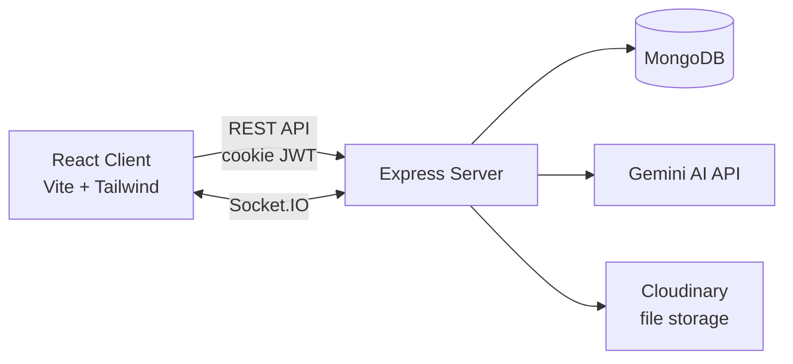

<div align="center">

# 🚀 DevFlow AI

### AI-Powered Project Management Platform

A Linear × Notion-inspired project management tool for engineering teams — Kanban boards, real-time collaboration, and a built-in AI copilot powered by Gemini.

[](https://dev-flow-ai-pied.vercel.app)
[](https://react.dev/)
[](https://nodejs.org/)
[](https://www.mongodb.com/)
[](https://socket.io/)
[](https://ai.google.dev/)
[](https://tailwindcss.com/)

**[🔗 Live Demo](https://dev-flow-ai-pied.vercel.app)**

</div>

---

## 📌 About

**DevFlow AI** unifies what teams usually spread across Jira, Trello, and Notion into a single, fast workspace — with an AI copilot woven directly into the workflow instead of bolted on as a chatbot.

Teams organize work as **Workspaces → Projects → Tasks**, collaborate live over Socket.IO (presence, comments, status updates), and use Gemini AI to write task descriptions, suggest priorities, break epics into subtasks, and summarize sprints — right from the task drawer.

---

## ✨ Features

**Project & Task Management**
- Workspaces with member invites, join-request approval, and role-based access
- Kanban board (Todo → In Progress → Review → Completed) with drag-and-drop
- Task drawer with tabs for overview, comments, attachments, activity log, and AI
- Calendar view and dashboard with burndown chart & workload distribution

**Real-Time Collaboration**
- Live presence indicators (who's online, per workspace)
- Instant task status sync across all connected clients via Socket.IO
- Live comment threads (add/edit/delete reflected instantly)
- In-app notifications for assignments and workspace activity

**AI Copilot (Gemini)**
- Auto-generate task descriptions from a title
- AI-suggested task priority
- Break a large task into subtasks automatically
- Project & sprint summaries on demand
- Context-aware chat assistant inside every task

**Other**
- Global command palette search (`Ctrl+K`) across projects, tasks, members, and comments
- File attachments via Cloudinary upload
- Secure HTTP-only cookie-based JWT authentication
- Fully responsive — dedicated mobile layout with bottom navigation

---

## 🏗️ Architecture



- **Client** — React (Vite), Tailwind CSS, Framer Motion, Context API for state (no Redux/Zustand)
- **Server** — Node.js + Express REST API, Socket.IO for real-time events
- **Database** — MongoDB
- **AI** — Google Gemini for description generation, prioritization, summarization, and chat
- **File storage** — Cloudinary for task attachments

---

## 🛠️ Tech Stack

| Layer | Technology |
|---|---|
| Frontend | React, Vite, Tailwind CSS, Framer Motion |
| Backend | Node.js, Express |
| Database | MongoDB |
| Real-time | Socket.IO |
| AI | Google Gemini |
| File Storage | Cloudinary |
| Auth | JWT (HTTP-only cookies) |
| Deployment | Vercel |

---

## 📁 Project Structure

```
DevFlow-AI/
├── client/          # React frontend (Vite, Tailwind, Framer Motion)
└── server/          # Express API + Socket.IO + MongoDB models
```

---

## 🔌 API & Real-Time Overview

**Auth flow**
```
POST /api/auth/register | /api/auth/login  → sets HTTP-only JWT cookie
GET  /api/auth/me                          → validates session on app load
```

**AI endpoints**
```
POST /api/ai/generate-task-description
POST /api/ai/suggest-priority
POST /api/ai/break-task
POST /api/ai/project-summary
POST /api/ai/sprint-summary
POST /api/ai/chat
```

**Socket.IO events**
| Event | Direction | Purpose |
|---|---|---|
| `online-users` | server → client | Presence updates |
| `task-status-updated` | server → client | Live Kanban sync |
| `comment-added` / `comment-updated` / `comment-deleted` | server → client | Live comment threads |
| `notification` | server → client | Task assignment / activity alerts |
| `join-workspace` / `join-task` | client → server | Room subscriptions |

**File uploads:** `POST /api/upload` (Cloudinary) → attach via `POST /api/task/:taskId/attachment`

---

## 🚀 Getting Started

**Prerequisites:** Node.js, MongoDB, a Gemini API key, a Cloudinary account

**1. Clone**
```bash
git clone https://github.com/Harsh-Kumar-Pandit/DevFlow-AI.git
cd DevFlow-AI
```

**2. Server setup**
```bash
cd server
npm install
```
Create `server/.env`:
```env
PORT=5000
MONGODB_URI=your-mongodb-uri
JWT_SECRET=your-jwt-secret
GEMINI_API_KEY=your-gemini-api-key
CLOUDINARY_CLOUD_NAME=your-cloud-name
CLOUDINARY_API_KEY=your-api-key
CLOUDINARY_API_SECRET=your-api-secret
```
```bash
npm run dev
```

**3. Client setup**
```bash
cd client
npm install
npm run dev
```

Client runs on `http://localhost:5173`, API on `http://localhost:5000`.

---

## 👤 Author

**Harsh Kumar Pandit** — B.Tech CSE, GGITS Jabalpur (RGPV)
[GitHub](https://github.com/Harsh-Kumar-Pandit) · [Live Demo](https://dev-flow-ai-pied.vercel.app)
